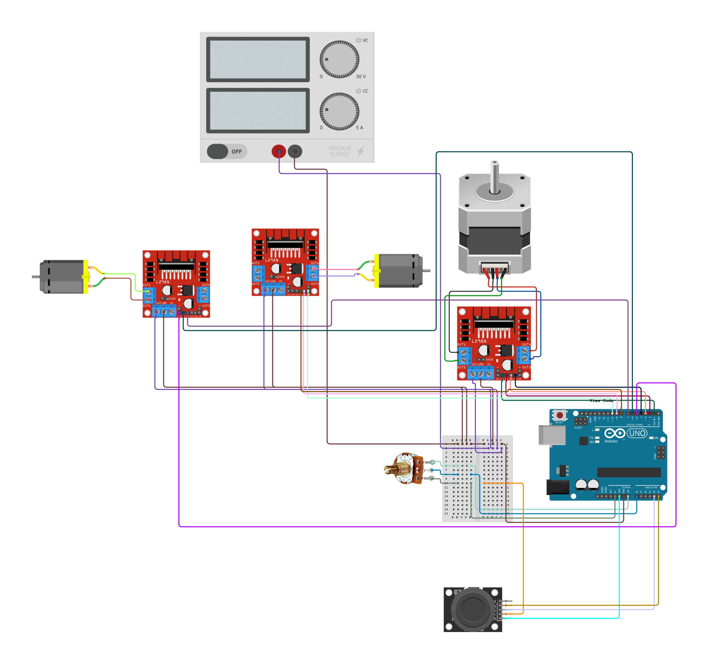

# WeBowling | Telepresence Bowling Game
This project is an interactive telepresence bowling game, created as part of the MIT GTL Bahrain 2025: Actuated Experiences workshop. 


## Project Overview
WeBowling is an interactive telepresence bowling game that beautifully merges the timeless joy of classic gameplay with the wonders of modern technology. By using a joystick, players can remotely unleash their bowling ball's potential, creating a captivating and engaging experience that transcends distance and brings people together in the spirit of fun and competition.

## GitHub Pages
You can view the live website on GitHub Pages: [WeBowling | Telepresence Bowling Game](https://batool5b.github.io/MISTI2025-WeBowling/)

## Key Features
- **Remote-Controlled Bowling**: Players can use a joystick to launch the bowling ball remotely, allowing for a unique telepresence gaming experience.
- **User-Friendly Interaction**: Simple joystick controls allow for easy aiming and launching.
- **Replayable Gameplay**: The option to restart and replay the game keeps the fun going by elevating the triangle, and showcasing engineering and interactive design principles in practice.
- **Effortless Integration of Electronic Systems**: The system is powered by an Arduino UNO, which processes user inputs from the joystick and potentiometer to control the motors efficiently.

## File Structure
```
.
├── assets/
│   ├── arduino_code/
│   │   └── WeBowling/
│   │       └── WeBowling.ino
│   ├── css/
│   │   └── style.css
│   ├── font/
│   │   ├── MuseoModerno/
│   │   └── Roboto/
│   └── js/
│       └── copy-btn.js
├── media/
│   ├── images/
│   │   ├── README/
│   │   ├── icon/
│   │   └── logo/
│   └── video/
│       └── demo.mp4
├── README.md
└── index.html
```

## Setup and Installation  
### Requirements
- **Hardware**:
  - Arduino Uno R3
  - NEMA 17 Bipolar Stepper Motor
  - RS390 DC Motors
  - L298N Dual H-Bridge Motor Driver 
  - KY-023 Dual Axis Joystick Module
  - Power Supply (Compatible with motors and Arduino)
  - Wiring & Connectors

- **Software**: Arduino IDE

### Steps
1. **Clone the repository**:
   ```bash
   git clone https://github.com/yourusername/WeBowling.git
   ```
2. **Open arduino code**:
   - Navigate to Arduino code
     ```bash
      cd assets/arduino_code/WeBowling/WeBowling.ino
     ```
   - Open the `.ino` file using the Arduino IDE.
3. **Install required libraries**:
   - Open the Arduino IDE Library Manager.
   - Install libraries: `Stepper by Arduino`
4. **Connect hardware**:
   - Follow circuit diagram:
   
5. **Upload Code**:
   - Select the correct board and port in the Arduino IDE.
   - Upload the code.
6. **Test the System**
